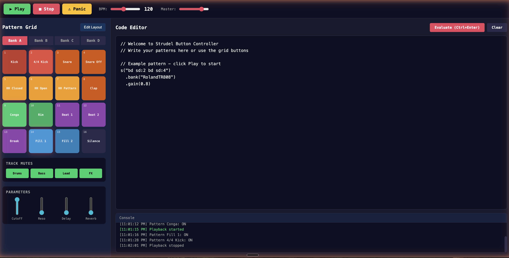

# Strudel Controller

A web-based button grid controller for live music performance, inspired by hardware drum machines and live coding environments like Strudel/TidalCycles.



## About

Strudel Controller provides a visual, button-based interface for triggering and layering audio patterns in real-time. Instead of typing code to create music, you press buttons on a 4x4 grid to activate patterns, adjust parameters with sliders, and build up complex layered compositions.

The application uses the Web Audio API to synthesize drum sounds and effects entirely in the browser - no samples or external dependencies required. It features a pattern scheduling system that keeps multiple patterns synchronized to a master tempo.

### Key Features

- 4x4 button grid with 4 pattern banks (64 total patterns)
- Real-time pattern triggering and layering
- Synthesized drum sounds (kick, snare, hi-hat, clap, open hat)
- Built-in effects chain: low-pass filter, delay, and reverb
- Tempo control (60-200 BPM)
- Master volume control
- Pattern bank switching (A/B/C/D)
- Track mute controls
- Custom button arrangement editor with localStorage persistence
- Code editor for custom pattern input
- Strudel-compatible pattern notation

## Installation

No build step required. Clone the repository and serve with any static file server:

```bash
git clone https://github.com/Sakeeb91/strudel-controller.git
cd strudel-controller
npx serve .
```

Or open `index.html` directly in a modern browser.

## Usage

1. Click any pattern button or the Play button to initialize audio
2. Click buttons in the grid to toggle patterns on/off
3. Active patterns are highlighted and play in sync
4. Use the parameter sliders to shape the sound:
   - **Cutoff**: Low-pass filter frequency
   - **Reso**: Filter resonance
   - **Delay**: Echo/delay mix
   - **Reverb**: Room reverb mix
5. Switch between banks A-D for different pattern sets
6. Use the code editor to write custom patterns using Strudel notation

### Pattern Notation

Patterns use a simplified Strudel-like notation:

- `bd` - kick drum
- `sd` - snare drum
- `hh` - closed hi-hat
- `oh` - open hi-hat
- `cp` - clap
- `~` - rest/silence
- `bd*4` - repeat 4 times

Example: `bd sd bd sd` plays a basic rock beat.

## Architecture

```
index.html          - Main HTML structure and UI layout
styles.css          - Dark theme styling inspired by hardware controllers
patterns.js         - Pattern bank definitions (4 banks x 16 patterns)
controller.js       - Main application logic
  - SoundEngine     - Web Audio synthesis and effects
  - StrudelController - UI binding and pattern management
```

## Browser Support

Requires a modern browser with Web Audio API support:
- Chrome 35+
- Firefox 25+
- Safari 14.1+
- Edge 79+

## License

MIT License

## Contributing

Contributions are welcome. Please open an issue to discuss proposed changes before submitting a pull request.
